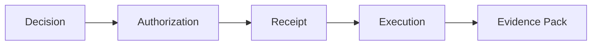

# Keon Systems: AI Governance Platform for Provable Execution and Compliance

  

### Governed Execution. Verifiable Decisions. Court-Defensible Proof.

**AI decisions can trigger real-world consequences—like deployments, account changes, or infrastructure modifications. But how do you prove they were authorized and compliant under audit or legal scrutiny?**

Keon is an **AI governance platform** that enforces explicit authorization, cryptographic receipts, and verifiable evidence for AI-assisted systems. It turns untraceable actions into **provable, audit-ready artifacts**—ensuring your AI operations survive forensics, compliance reviews, and court examinations.

This repository contains the **public documentation, concepts, and verification artifacts** for the Keon governance model.

---

## Why Keon Exists: Solving AI Governance and Forensics Challenges

AI systems have crossed a threshold.

They no longer just *advise* — they **trigger actions**:

* deployments
* account changes
* workflow execution
* infrastructure modification
* automated decisions with real consequences

Most “AI governance” solutions focus on:

* prompts
* alignment
* monitoring
* after-the-fact logs

Keon addresses a harder problem:

> **How do you prove, months or years later, that an AI-assisted action was explicitly authorized, policy-compliant, and executed under accountable human or system authority?**

This is not an observability problem.
It is a **forensics and accountability problem**—critical for **AI compliance evidence**, **provable AI execution**, and **court-defensible AI proofs**.

---

## What is Keon? An AI Governance Platform Overview

Keon is a **decision governance layer** that sits *between intent and execution*.

It enforces a strict, mechanical boundary:

**Decision → Authorization → Receipt → Execution → Evidence**

Every governed action produces:

* an explicit authorization decision
* a cryptographic receipt
* a traceable audit record
* a verifiable evidence bundle suitable for **investigation and review**

If authorization is missing, ambiguous, or unverifiable — **execution does not occur**.

---

## What Keon is Not

Keon is intentionally narrow.

Keon does **not**:

* reason with LLMs
* generate plans or workflows
* initiate actions
* execute tasks
* replace compliance frameworks
* render legal judgments

Keon exists to make **execution provable**, not intelligent — and to ensure that claims about authorization can be **independently verified**.

---

## How Does Governed Execution Work in Keon?

In Keon’s model:

* AI outputs are treated as **requests**, not commands
* Execution is **fail-closed by default**
* Authority is **explicit**, never implied
* Evidence is a **first-class artifact**

This allows organizations to answer questions commonly raised in:

* security investigations
* compliance reviews
* internal audits
* incident response
* e-discovery
* litigation and court proceedings

Such as:

* *Who authorized this action?*
* *Under which policy and version?*
* *What evidence was evaluated at the time?*
* *What would have happened if authorization failed?*
* *Can a third party reproduce and verify this decision path?*

---

## Receipts and Evidence Packs: Building AI Compliance Evidence

Every governed decision produces a **receipt**.

Receipts are:

* immutable
* attributable
* verifiable
* chainable across systems

Related receipts and artifacts are bundled into **evidence packs**, which are designed to be:

* preserved for long-term retention
* exported for investigations
* reviewed during audits
* produced during e-discovery
* examined in adversarial or legal contexts

Evidence packs are built so that **trust in the system operator is not required**.

---

## Digital Forensics and AI Investigations with Keon

Keon’s evidence model is designed for **post-incident reconstruction**.

Using Keon artifacts, an investigator can determine:

* what decision was proposed
* what policy evaluated it
* who or what authorized it
* when execution occurred
* what evidence was available at the time
* whether execution would have failed under different conditions

This makes Keon suitable for environments where **actions must be explainable long after execution**, not just observable in real time.

---

## Who is Keon For? Target Users and Use Cases

Keon is built for teams operating systems where **mistakes have legal, financial, or safety impact**:

| Role/Team | Use Case | Benefits |
|-----------|----------|----------|
| Platform Engineering | AI infrastructure governance | Provable deployments and changes |
| AI Infrastructure | Executing AI-triggered actions | Verifiable compliance |
| DevOps and SRE | Workflow automation | Audit-ready execution traces |
| Security and Compliance | AI decision auditing | Court-defensible proofs |
| Regulated Environments | Enterprise AI deployment | Forensic evidence packs |
| Audit, Risk, and Assurance | Incident response | Independent verification |
| Legal and Investigations | E-discovery and litigation | Tamper-evident artifacts |

If your system may one day be examined by an auditor, regulator, or court, Keon exists to make its behavior **defensible and provable**.

---

## Keon's Relationship to Governed Systems (Like OMEGA)

Keon does not execute actions.

Instead, governed systems integrate Keon to:

* request authorization
* receive decisions
* emit receipts
* preserve evidence
* prove compliance after the fact

This separation ensures Keon remains neutral, portable, and suitable as an **independent governance and evidentiary layer**.

> **Keon decides. Governed systems execute. Receipts prove.**

---

## How to Use This Repository: Getting Started with Keon Docs

This repo is structured to support both **humans and verification tools**.

Recommended reading order:

1. **[START_HERE.md](./docs/START_HERE.md)** — conceptual foundation and mental model
2. **Concepts** — governed execution, receipts, fail-closed systems
3. **Runtime / API docs** — decision and execution boundaries
4. **Proof campaigns** — what is proven and how to verify it
5. **Evidence artifacts** — audit- and court-grade outputs

If a claim cannot be traced to code, a tag, or a proof artifact, it should be treated as incomplete.

### Next Steps
- Explore the [docs folder](./docs/) for in-depth guides.
- Star this repo for updates on AI governance best practices.
- Contribute: Open an issue for questions or suggestions.

---

## Design Principles

Keon documentation follows these rules:

* Precision over persuasion
* Proof over promises
* Explicit authority over implicit trust
* Determinism over heuristics
* Auditability over convenience
* Forensic defensibility over narrative comfort

---

## Status

Keon is actively developed and used as a governance substrate for real execution systems.

Public documentation focuses on:

* concepts
* verification models
* forensic evidence artifacts
* reproducible proof

Product positioning, deployments, and integrations live outside this repository.

---

## License

See the [repository license](LICENSE) for usage terms.

---

### One-Line Summary

> **Keon makes execution provable — even under investigation.**

---
