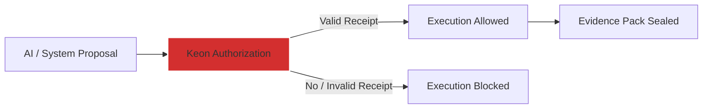

# **START HERE — What Keon Is and Why It Exists**  

## OMEGA Whitepaper

- **OMEGA Governed Execution Whitepaper (Markdown):** [omega-docs/whitepapers/omega-governed-execution.md](https://github.com/omega-brands/omega-docs/blob/main/whitepapers/omega-governed-execution.md)
- **OMEGA Governed Execution Whitepaper (PDF):** [omega-docs/assets/whitepapers/omega-governed-execution.pdf](https://github.com/omega-brands/omega-docs/blob/main/assets/whitepapers/omega-governed-execution.pdf)

**Keon turns AI-triggered actions into court-defensible, independently verifiable proof — before a single line of code ever runs in production.**

**30-second summary**  
Keon is the **governance and forensic substrate** for AI-assisted systems where decisions cause real execution.

It enforces policy **before execution**, records **explicit authority**, and produces **verifiable evidence packs** that survive audit, investigation, e-discovery, and courtroom scrutiny.

> **Execution proposes. Governance decides. Receipts prove.**

---

## The problem Keon solves

AI has crossed from advisory → **operational**.

Today AI systems:

- deploy infrastructure
- modify accounts & permissions
- trigger workflows
- make decisions with legal / financial / safety consequences

Most “AI governance” tools stop at:

- prompt safety
- alignment
- real-time monitoring
- post-hoc logs

They collapse when the real questions arrive months or years later:

> *Who authorized this change?*  
> *Under which ratified policy version?*  
> *What exact evidence was evaluated?*  
> *Can this decision be independently reproduced and verified?*

That’s **not observability**.  
That’s a **forensics & accountability gap**.

---

## What Keon actually is

Keon is the **decision governance layer** between intent and execution.

It enforces one mechanical boundary:

**Decision → Authorization → Receipt → Execution → Evidence**

Every governed action must produce:

- explicit authorization decision
- cryptographic receipt
- tamper-evident audit trail
- verifiable **evidence pack** suitable for forensic review

No valid receipt? → **No execution**.

---

## What Keon is **not**

Keon stays narrow by design. It does **not**:

- reason with LLMs
- generate plans / workflows
- initiate actions
- execute anything
- replace your compliance program
- pretend to be a lawyer

Keon exists to make **execution provable** — full stop.

---

## Governed execution — the core mental model

- AI outputs = **requests**, never commands
- Execution = **fail-closed** by default
- Authority = **explicit & attributable**, never implied
- Evidence = **first-class deliverable**

This model lets organizations answer the questions regulators, auditors, lawyers, and incident responders actually ask:

- Who approved this?
- Under what policy version?
- What was the evidence at decision time?
- What would have happened if auth failed?
- Can a third party verify the entire chain?

---

## Evidence Packs — digital forensics by design

The atomic unit of truth in Keon is the **Evidence Pack**.

Each pack is a tamper-evident bundle containing:

- **Decision** — what was requested
- **Policy** — what governed evaluation
- **Authority** — who/what approved it
- **Execution** — what actually ran
- **Proof** — cryptographic receipts chaining everything

Properties:

- human-readable JSON + binary receipts
- machine-verifiable signatures
- immutable once sealed
- long-term retention ready
- exportable for legal / audit use

Sealed packs live in the **Keon Evidence Vault** (append-only).

---

## Digital forensics & post-incident reconstruction

Keon artifacts let investigators reconstruct:

- Proposed decision
- Governing policy snapshot
- Authorization chain (human or system)
- Execution timeline
- Evidence evaluated at decision time
- Alternate outcomes under different auth conditions

Designed for environments where **explainability must last years**, not just real-time dashboards.

---

## Lifecycle governance — birth, death, and automation

Keon doesn't only govern point-in-time decisions. It governs the **full lifecycle** of autonomous digital entities.

**Governed Birth** — Entity creation requires explicit authority. Every entity begins with a receipt-bound genesis event. No entity exists without a governed creation record.

**Governed Death** — Revocation and termination produce immutable lineage. No death without birth (prevents phantom entities). No double-death (prevents state corruption). Receipt chains link creation → termination with no gaps.

**Governed Automation** — Policies can trigger automatic governance actions, but always with accountability:

- Severity gradation: RECOMMEND → AUTO_REVOKE → AUTO_TERMINATE
- Human gate enforcement for irreversible actions
- Cooldown periods to prevent policy flapping
- Fail-closed: ambiguous or incomplete context defaults to NO_ACTION
- Full attribution: policy ID, version, automation flag, and trigger events

> *Machines may act automatically — but Keon can always prove why, under whose authority, and with what limits.*

---

## Governance surfaces

### Keon Control (human governance surface)

Cross-system view for:

- policy lifecycle
- receipt & evidence exploration
- audit console
- forensic review
- compliance oversight

Iron rule:  
**Keon never executes. Keon decides. Applications observe — they never govern.**

---

## Relationship to governed systems (e.g. OMEGA)

Keon does **not** run code.

Governed runtimes integrate Keon to:

- request authorization
- receive decisions + obligations
- emit receipts
- preserve evidence packs
- prove compliance later

> **Keon decides.  
> Governed systems execute.  
> Receipts prove.**

---

## Choose your path

| Goal                              | Time       | Start here                                                   |
|-----------------------------------|------------|--------------------------------------------------------------|
| Understand Keon quickly           | 5–10 min   | This page                                                    |
| Grasp the full architecture       | 15–30 min  | [CGAE v1.0.0 (canonical whitepaper)](./docs/whitepapers/cgae/v1.0.0.md) |
| Explore the full whitepaper library | 30 min     | [Whitepapers index (canonical + archive)](./docs/whitepapers/index.md) |
| Verify every public claim         | 30–60 min  | [Claims Registry](./canon/CLAIMS_REGISTRY.yaml) [KS-EVIDENCE-004] |
| See real production usage         | 30+ min    | [OMEGA](https://github.com/m0r6aN/omega-docs)                |
| Audit / forensic deep-dive        | 1–2 hrs    | [Proof maps + sealed Evidence Packs](./EVIDENCE/README.md)   |
| Verify proven capabilities        | 15–30 min  | [Proof Campaign Status](https://github.com/m0r6aN/omega-docs/blob/main/REPORT/PROOFS/PROOF_CAMPAIGN_STATUS.md) |

---

## Design principles (non-negotiable)

- Proof over promises
- Explicit authority over implicit trust
- Fail-closed by default
- Determinism over heuristics
- Forensic defensibility over narrative comfort

---

**One-line truth**

> **Keon makes execution provable — from creation through termination, even when lawyers and regulators are watching.**
